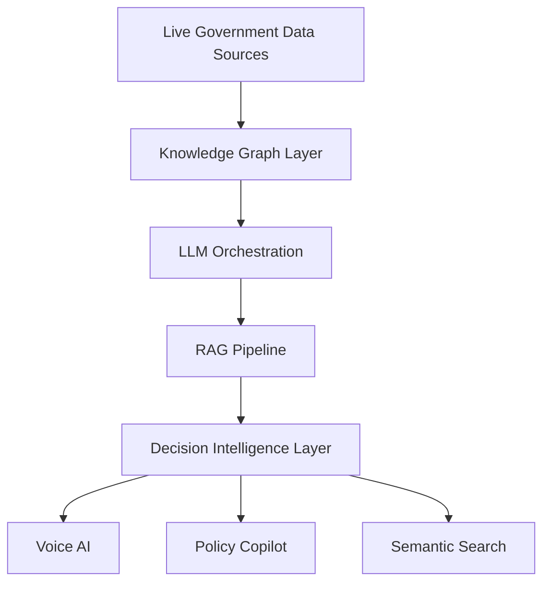

<div align="center">

# Manasvi Gangrade

### AI Researcher • Full-Stack AI Engineer • LLM Systems • Optimization • ANN Search

<p align="center">
  
</p>

<p align="center">
  <a href="mailto:gangrademanasvi@gmail.com">
    
  </a>
  
  <a href="https://linkedin.com/in/YOUR_LINKEDIN">
    
  </a>
  
  <a href="https://github.com/YOUR_GITHUB_USERNAME">
    
  </a>
</p>


</div>

---

# Profile

```yaml
Name: Manasvi Gangrade
Role: AI Researcher & Full-Stack AI Engineer

Education:
  Degree: B.Tech in Artificial Intelligence & Machine Learning
  Institute: Indore Institute of Science & Technology
  Graduation: 2027
  SGPA: 8.79
  CGPA: 7.98

Core Domains:
  - LLM-Augmented Optimization
  - Agentic AI Systems
  - Retrieval-Augmented Generation
  - Approximate Nearest Neighbor Search
  - Cognitive AI & EEG Modeling
  - High-Dimensional Vector Retrieval
  - Governance Intelligence Systems

Highlights:
  - Winner: Indore Tech Hackathon 2025 (₹4L)
  - Winner: IIT Bombay I-Hack (₹1L)
  - Grand Finalist: Smart India Hackathon 2024
  - Top 2% AIML Department
```

---

# Technical Stack

## Languages

<p>

</p>

---

## AI / Machine Learning

<p>

</p>

```txt
LLMs • RAG • Agentic Systems • LangChain • LangGraph
CrewAI • Prompt Engineering • RL-inspired Optimization
Computer Vision • NLP • CNNs • RNNs • Transformers
Knowledge Graphs • ANN Search • FAISS • HNSWLIB
```

---

## Backend / Full Stack

<p>

</p>

```txt
REST APIs • WebSockets • Socket.io • Authentication Systems
Distributed Architectures • Kafka • Redis • Real-time Systems
```

---

## Databases & Infrastructure

<p>

</p>

```txt
Neo4j • ChromaDB • Pinecone • Vector Databases
AWS EC2 • AWS S3 • Airflow • Cloud-Native Pipelines
```

---

# Technical Projects

# INDRA — Integrated National Decision & Response Architecture

### Governance Intelligence Operating System

```txt
Neo4j • LangChain • GPT-4o • FastAPI • React
IndicTrans2 • PostgreSQL • Multi-Agent RAG
```

### Core Features

- Unified governance intelligence layer over 500+ live datasets
- RAG-powered administrative co-pilot
- Semantic entity linking across departments
- Multilingual AI assistant across 22 Indian languages
- Real-time voice translation across 230+ languages
- Live deployment showcase at Bharat Mandapam, New Delhi

### System Design



---

# SUVIDHA — Smart Urban Digital Helpdesk

```txt
React • Node.js • PostgreSQL • Kafka • Redis
AES-256 • TLS 1.3 • OTP Authentication
```

### Features

- Unified urban citizen service platform
- Real-time event-driven architecture using Kafka
- Secure encrypted transaction pipeline
- Redis-backed low-latency session handling
- Multilingual interface architecture

---

# OceanDepths — Marine Intelligence Platform

### Smart India Hackathon 2025 — Ministry of Earth Sciences

```txt
Python • AWS S3 • MongoDB • Apache Airflow
OCR • ETL Pipelines • Cloud Data Lakes
```

### Features

- Unified oceanographic + taxonomic data lake
- OCR-powered digitization of legacy research
- Automated ETL workflows
- Searchable scientific intelligence platform

---

# Responsible Gaming Platform

### Winner — IIT Bombay I-Hack

```txt
MERN • Socket.io • ML/DL • Behavioral Analytics
```

### Features

- Gaming vs Gambling addiction classification
- Real-time monitoring pipelines
- Behavioral intervention recommendation engine
- WebSocket-powered live analytics

---

# NASA Space Biology Knowledge Engine

```txt
Knowledge Graphs • LLMs • Semantic Retrieval
Scientific Intelligence Systems
```

### Features

- Knowledge graph over 608 NASA publications
- Cross-paper semantic discovery
- Research acceleration for Moon & Mars missions
- AI-powered scientific retrieval system

---

# Production Experience

# RAG-based Urban Intelligence System
### Indore Smart City Development

```txt
Production RAG • Governance AI • Urban Data Intelligence
```

- Designed and deployed large-scale civic intelligence RAG architecture
- Enabled natural language access over heterogeneous urban datasets
- Built for municipal governance workflows and public-scale deployment

---

# Garun — Geospatial Illegal Construction Detection

### Indore Municipal Corporation

```txt
Computer Vision • GIS • Drone Surveillance • Geospatial AI
```

- Real-time illegal construction detection system
- GIS-integrated drone surveillance pipeline
- Automated urban monitoring workflows

---

# Dynamic Mail Transmission System
### Ministry of Telecommunications — SIH 2024

```txt
RL-inspired Optimization • Multimodal Logistics • Route Intelligence
```

- National-scale logistics optimization framework
- Dynamic transport selection:
  - Rail
  - Air
  - Road
  - Waterways

- Reinforcement learning-inspired heuristic routing engine

---

# Research Work

# Automating Heuristic Design with Large Language Models

### Research Area
LLM-Augmented Combinatorial Optimization

```txt
TSP • VRP • JSSP • Evolutionary Prompting
Automated Heuristic Generation
```

### Contributions

- Developed LLM-Heuristic framework replacing handcrafted heuristics
- Introduced:
  - Diversity-aware prompting
  - Evolutionary mutation & crossover
  - Performance-driven refinement loops

### Theory

- Monotonic improvement guarantees
- Sample complexity analysis
- Convergence under elitism

---

# Similarity Search on High-Dimensional Vector Data

### Research Area
Approximate Nearest Neighbor Search

```txt
ANN Search • Product Quantization • Sparse JL Projections
FAISS • HNSW • High-Dimensional Retrieval
```

### Contributions

- Designed AKNN systems with theoretical guarantees
- Learned Product Quantization framework
- Multi-index hybrid retrieval architectures
- Sparse vector retrieval optimization

### Applications

- RAG acceleration
- Semantic retrieval systems
- Latency-sensitive vector search

---

# Decoding Career Decision Confidence from EEG Dynamics

### Research Area
Cognitive AI & Neural Signal Modeling

```txt
EEG • CNN-LSTM • Temporal Attention
Signal Processing • Neural Oscillations
```

### Contributions

- Hybrid CNN-LSTM architecture with temporal attention
- Delta-Gamma oscillation modeling
- CWT/HHT preprocessing pipelines
- Saliency & attention visualization systems
- Transfer learning using public EEG datasets

---

# Achievements

| Achievement | Recognition |
|---|---|
| Indore Tech Hackathon 2025 | ₹4L Prize |
| IIT Bombay I-Hack | ₹1L Prize |
| InnovateX IIT Bombay | ₹50K Prize |
| Smart India Hackathon 2024 | Grand Finalist |
| VISIONX ISRO | 1st Runner-Up |
| Indian Talent Science Olympiad | State Topper |
| Mumbai Tech Hackathon 2025 | Guinness GenAI Hackathon Finalist |

---

# Leadership

```txt
AI/ML Research Lead
- Mentoring junior researchers
- Reviewing research papers
- Leading multidisciplinary AI teams

Event Host & Public Speaker
- Hosted annual college fest (2 years)
- Conducted induction & technical events
```

---

# GitHub Analytics

<div align="center">


</div>

---

# Connect

<p align="center">

<a href="mailto:gangrademanasvi@gmail.com">
  
</a>

<a href="https://linkedin.com/in/YOUR_LINKEDIN">
  
</a>

<a href="https://github.com/YOUR_GITHUB_USERNAME">
  
</a>

</p>

---

<div align="center">

```txt
Building intelligent systems that bridge research, governance,
optimization, and scalable AI infrastructure.
```

</div>
