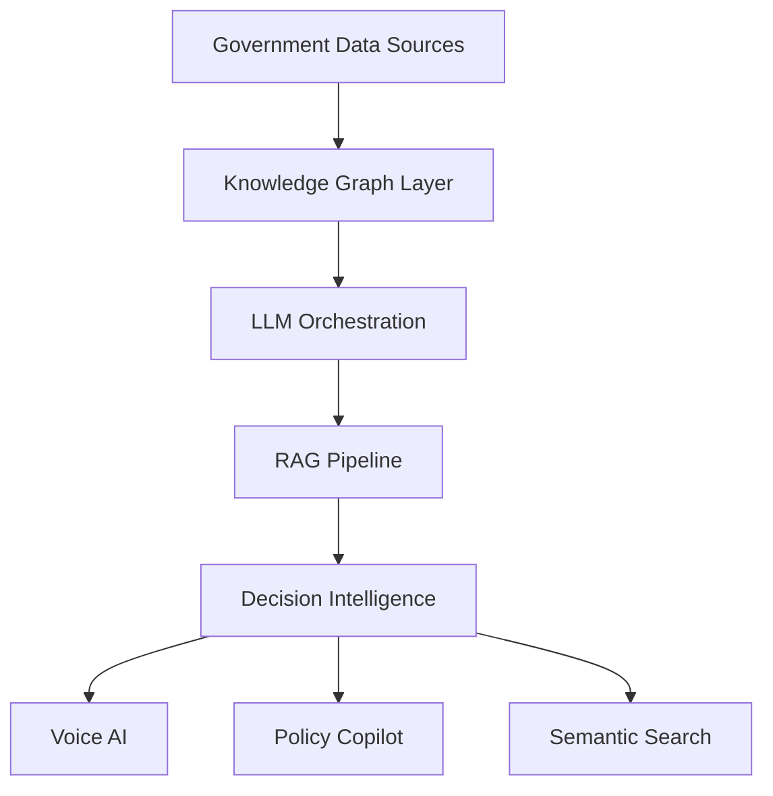

<div align="center">


<br/>


<br/><br/>

<a href="mailto:gangrademanasvi@gmail.com">
  
</a>

<a href="https://linkedin.com/in/manasvi-gangrade-9941952bb">
  
</a>

<a href="https://github.com/Manasvi-Gangrade">
  
</a>

<br/><br/>


</div>

---

#  About Me

```yaml
Name: Manasvi Gangrade
Role: AI Researcher & Full-Stack AI Engineer

Education:
  Degree: B.Tech in Artificial Intelligence & Machine Learning
  Institute: Indore Institute of Science & Technology
  Graduation: 2027
  SGPA: 8.79
  CGPA: 7.98

Research Interests:
  - LLM-Augmented Optimization
  - Approximate Nearest Neighbor Search
  - Agentic AI Systems
  - Retrieval-Augmented Generation
  - Cognitive AI & EEG Modeling
  - Governance Intelligence Systems

Academic Highlights:
  - Top 2% AIML Department
  - 20+ National-Level Competitions
  - Highest Podium Record Across IIT & Govt Hackathons

Achievements:
  - Winner: Indore Tech Hackathon 2025 (₹4L)
  - Winner: IIT Bombay I-Hack (₹1L)
  - Winner: InnovateX IIT Bombay (₹50K)
  - Grand Finalist: Smart India Hackathon 2024
```

---

#  Research Domains

<div align="center">

| Domain | Focus |
|---|---|
| LLM Systems | Autonomous reasoning & heuristic generation |
| Optimization | TSP, VRP, JSSP, RL-inspired systems |
| ANN Search | FAISS, HNSW, Product Quantization |
| Cognitive AI | EEG dynamics & confidence decoding |
| Agentic AI | Multi-agent orchestration & RAG |
| Governance AI | Smart-city intelligence systems |


</div>

---

#  Technical Stack

<div align="center">

## Languages


<br/><br/>

## AI / ML


<br/>


<br/><br/>

## Backend / Infrastructure


</div>

---

#  Featured Technical Projects

# 🇮🇳 INDRA — Integrated National Decision & Response Architecture

<div align="center">


[](mailto:gangrademanasvi@gmail.com)
[](https://linkedin.com/in/manasvi-gangrade-9941952bb)
[](https://github.com/Manasvi-Gangrade)
&nbsp;


</div>

```txt
Neo4j • LangChain • GPT-4o • FastAPI • React
IndicTrans2 • PostgreSQL • Multi-Agent RAG
```

### Features

- Governance intelligence layer over 500+ live datasets
- RAG-powered administrative co-pilot
- Semantic entity linking across departments
- Multilingual AI assistant across 22 Indian languages
- Voice translation across 230+ languages

<div align="center">

<a href="https://github.com/Manasvi-Gangrade">
  
</a>

<a href="#">
  
</a>

</div>

### Architecture



---

# 🏙️ SUVIDHA — Smart Urban Digital Helpdesk
I'm a third-year AI/ML undergrad at IIST Indore building systems where research meets deployment — LLM-augmented optimization, approximate nearest neighbor search, and agentic architectures for real governance and logistics problems. My work has shipped to Indore Smart City, the Ministry of Telecommunications, and was demonstrated live at Bharat Mandapam, New Delhi.

<div align="center">


</div>

```txt
React • Node.js • PostgreSQL • Kafka • Redis
AES-256 • TLS 1.3 • OTP Authentication
```

### Features

- Unified citizen-service platform
- Kafka-driven event architecture
- Secure encrypted transaction pipeline
- Redis-backed low-latency sessions
- Multilingual interface support

<div align="center">

<a href="https://github.com/Manasvi-Gangrade">
  
</a>

<a href="#">
  
</a>

</div>
**Currently working on:** automating heuristic design with LLMs (TSP/VRP/JSSP), quantization-based ANN search with theoretical guarantees, and EEG-based cognitive decision decoding.

---

# 🌊 OceanDepths — Marine Intelligence Platform
## Research

<div align="center">
### Automating Heuristic Design with Large Language Models
*Supervised by Prof. Dr. Shweta Agrawal*


Replacing hand-crafted heuristics with LLM-driven automated algorithm design across TSP, VRP, and JSSP. The framework uses diversity-aware multi-stage prompting with evolutionary mutation/crossover and a performance-driven feedback loop for iterative refinement. Includes theoretical convergence guarantees — monotonic improvement under elitism with derived sample complexity bounds.

</div>
> *Manuscript in preparation*

```txt
Python • AWS S3 • MongoDB • Apache Airflow
OCR • ETL Pipelines • Cloud Data Lakes
```
### Similarity Search on High-Dimensional Vector Data
*Supervised by Prof. Piyush Parmar*

### Features
Designing quantization-based AKNN algorithms with formal accuracy guarantees — addressing the core limitation of HNSW and IVF-PQ, which lack theoretical error bounds critical for latency-sensitive RAG pipelines. Work covers learned product quantization with asymptotically optimal rate-distortion bounds and sparse Johnson-Lindenstrauss projections.

- Unified oceanographic + taxonomic data lake
- OCR-powered legacy field digitization
- Automated ETL workflows
- Searchable scientific intelligence system
### Decoding Career Decision Confidence from Non-Stationary EEG Dynamics
*Supervised by Prof. Dr. Shweta Agrawal*

<div align="center">

<a href="https://github.com/Manasvi-Gangrade">
  
</a>

<a href="#">
  
</a>

</div>
Extending EEG confidence decoding from simple perceptual tasks to complex career decision-making — an underexplored domain. Hybrid CNN-LSTM with temporal attention over CWT/HHT-processed Delta-Gamma signals, with interpretability via saliency maps and attention visualization.

---

# 🎮 Responsible Gaming Platform

<div align="center">


</div>

```txt
MERN • Socket.io • ML/DL • Behavioral Analytics
```

### Features
## Production Work

- Gaming vs Gambling addiction classification
- Real-time monitoring
- Personalized intervention systems
- WebSocket-powered analytics

<div align="center">

<a href="https://github.com/Manasvi-Gangrade">
  
</a>

<a href="#">
  
</a>

</div>
| Project | Role | Scope |
|---|---|---|
| **RAG-based Urban Intelligence System** | AI Developer, Indore Smart City | Production RAG over 200+ civic datasets; NL query access for municipal staff & 3M+ citizens |
| **Garun — Illegal Construction Detection** | AI Developer, Indore Municipal Corporation | CV + GIS pipeline for real-time drone-based urban enforcement |
| **Dynamic Mail Transmission System** | AI Logistics Lead, Ministry of Telecom (SIH Grand Finalist) | RL-inspired multimodal routing across road, rail, air, water for India Post's national network |

---

# 🚀 NASA Space Biology Knowledge Engine

<div align="center">


</div>
## Featured Projects

```txt
Knowledge Graphs • Semantic Retrieval • Scientific AI
```
### INDRA — Integrated National Decision & Response Architecture
`Neo4j` `LangChain` `GPT-4o` `FastAPI` `React` `IndicTrans2` `PostgreSQL`

### Features
Governance intelligence OS over 500+ live data sources. Ships two core products: **INDRA VOICE** — a multilingual AI agent across 22 Indian languages with 230+ voice translations — and **INDRA PILOT** — a RAG-powered real-time policy co-pilot with semantic entity linking across government departments. Demonstrated live at India Innovates 2026, Bharat Mandapam, New Delhi.

- Knowledge graph over 608 NASA publications
- Cross-paper semantic discovery
- AI-powered scientific retrieval system

<div align="center">

<a href="https://github.com/Manasvi-Gangrade">
  
</a>

<a href="#">
  
</a>

</div>
[](https://github.com/Manasvi-Gangrade)

---

#  Production Experience

# 🌆 RAG-based Urban Intelligence System

```txt
Production RAG • Governance AI • Urban Intelligence
```

- Large-scale civic intelligence architecture
- Natural language querying over urban datasets
- Municipal-scale AI deployment
### SUVIDHA — Smart Urban Digital Helpdesk
`React` `Node.js` `PostgreSQL` `Redis` `Kafka` `AES-256` `TLS 1.3`

<div align="center">

<a href="https://github.com/Manasvi-Gangrade">
  
</a>
Unified citizen-service kiosk for Electricity, Gas, and Municipal services. End-to-end encrypted transaction pipeline (AES-256, TLS 1.3), Kafka-driven real-time event streaming, Redis-cached sessions, and OTP authentication.

</div>
[](https://github.com/Manasvi-Gangrade)

---

# 🛰️ Garun — Geospatial Illegal Construction Detection

```txt
Computer Vision • GIS • Drone Surveillance
```

### Features
### OceanDepths — Marine Intelligence Platform
`Python` `PyTorch` `AWS S3` `MongoDB` `Apache Airflow` `Tesseract OCR`

- Real-time illegal construction detection
- GIS-integrated drone monitoring
- Automated urban surveillance workflows
Cloud-native data lake unifying oceanographic, taxonomic, and eDNA datasets for the Ministry of Earth Sciences. OCR-powered ETL pipelines digitize legacy field notes into a queryable scientific intelligence system.

<div align="center">

<a href="https://github.com/Manasvi-Gangrade">
  
</a>

</div>
[](https://github.com/Manasvi-Gangrade)

---

# 📦 Dynamic Mail Transmission System
### NASA Space Biology Knowledge Engine
`Python` `Knowledge Graphs` `LLMs` `Data Visualization`

```txt
RL-inspired Optimization • Multimodal Routing
```
AI-powered knowledge graph and semantic search over 608 NASA space biology publications — surfacing cross-paper insights for Moon and Mars mission planning research.

### Features

- National-scale logistics optimization
- Dynamic transport selection
- Reinforcement learning-inspired heuristics

<div align="center">

<a href="https://github.com/Manasvi-Gangrade">
  
</a>

</div>
[](https://github.com/Manasvi-Gangrade)

---

#  Research Work

# 🧩 Automating Heuristic Design with Large Language Models
### Responsible Gaming Platform
`MERN` `Socket.io` `ML/DL` `Behavioral Analytics`

<div align="center">
Full-stack ML platform for gaming vs. gambling addiction classification with real-time WebSocket monitoring and personalized intervention alerts. **Winner, IIT Bombay I-Hack (₹1L).**


</div>

```txt
TSP • VRP • JSSP • Evolutionary Prompting
```

### Contributions

- LLM-Heuristic framework
- Evolutionary mutation & crossover
- Performance-driven refinement loops
- Convergence guarantees
[](https://github.com/Manasvi-Gangrade)

---

# 🔍 Similarity Search on High-Dimensional Vector Data
## Stack

<div align="center">
**Languages** — Python · C++ · C · JavaScript · TypeScript · SQL


**AI / ML** — PyTorch · TensorFlow · LangChain · LangGraph · LangSmith · CrewAI · HuggingFace Transformers · OpenCV · spaCy · Scikit-Learn

</div>
**Vector & Search** — FAISS · HNSWLIB · ChromaDB · Pinecone · Neo4j (Knowledge Graphs)

```txt
ANN Search • Product Quantization • FAISS • HNSW
```

### Contributions

- AKNN systems with theoretical guarantees
- Learned Product Quantization
- Sparse vector retrieval optimization
**Backend / Infra** — FastAPI · Django · Node.js · Express · Next.js · PostgreSQL · MongoDB · Redis · Kafka · Docker · AWS (S3, EC2) · Firebase

---

# 🧠 Decoding Career Decision Confidence from EEG Dynamics

<div align="center">
## Achievements


</div>

```txt
EEG • CNN-LSTM • Temporal Attention
```

### Contributions

- Hybrid CNN-LSTM architecture
- Neural oscillation modeling
- Saliency & interpretability systems
- 🥇 **Indore Tech Hackathon 2025** — ₹4L · Government of Madhya Pradesh & Indore Municipal Corporation
- 🥇 **IIT Bombay I-Hack** — ₹1L · Responsible Gaming Platform
- 🥇 **InnovateX, IIT Bombay** (Somany Impressa Group) — ₹50K · Automated sanitary logistics (Hindware)
- 🚀 **Smart India Hackathon 2024** — Grand Finalist · Top <2% of 50,000+ teams · Ministry of Telecom
- 🛰️ **VISIONX ISRO** — 1st Runner-Up
- 🏆 **State Topper** — Indian Talent National Science Olympiad
- Finalist: Parikalp '25 MANIT · Astro Venture '25 · L'Oréal Brandstorm · Mumbai Tech Hackathon 2025

---

#  Achievements
## GitHub Stats

<div align="center">

| Achievement | Recognition |
|---|---|
| 🥇 Indore Tech Hackathon 2025 | ₹4L Prize |
| 🥇 IIT Bombay I-Hack | ₹1L Prize |
| 🥇 InnovateX IIT Bombay | ₹50K Prize |
| 🚀 Smart India Hackathon 2024 | Grand Finalist |
| 🛰️ VISIONX ISRO | 1st Runner-Up |
| 🧪 Indian Talent National Science Olympiad | State Topper |


</div>

---


#  GitHub Analytics
</div>

<div align="center">


<br/><br/>


</div>

---

#  Connect With Me

<div align="center">

<a href="mailto:gangrademanasvi@gmail.com">
  
</a>

<a href="https://linkedin.com/in/manasvi-gangrade-9941952bb">
  
</a>

<a href="https://github.com/Manasvi-Gangrade">
  
</a>
<sub>B.Tech · AI & Machine Learning · Indore Institute of Science & Technology · Expected 2027 · CGPA 7.98 · SGPA 8.79</sub>

</div>

<br/>


