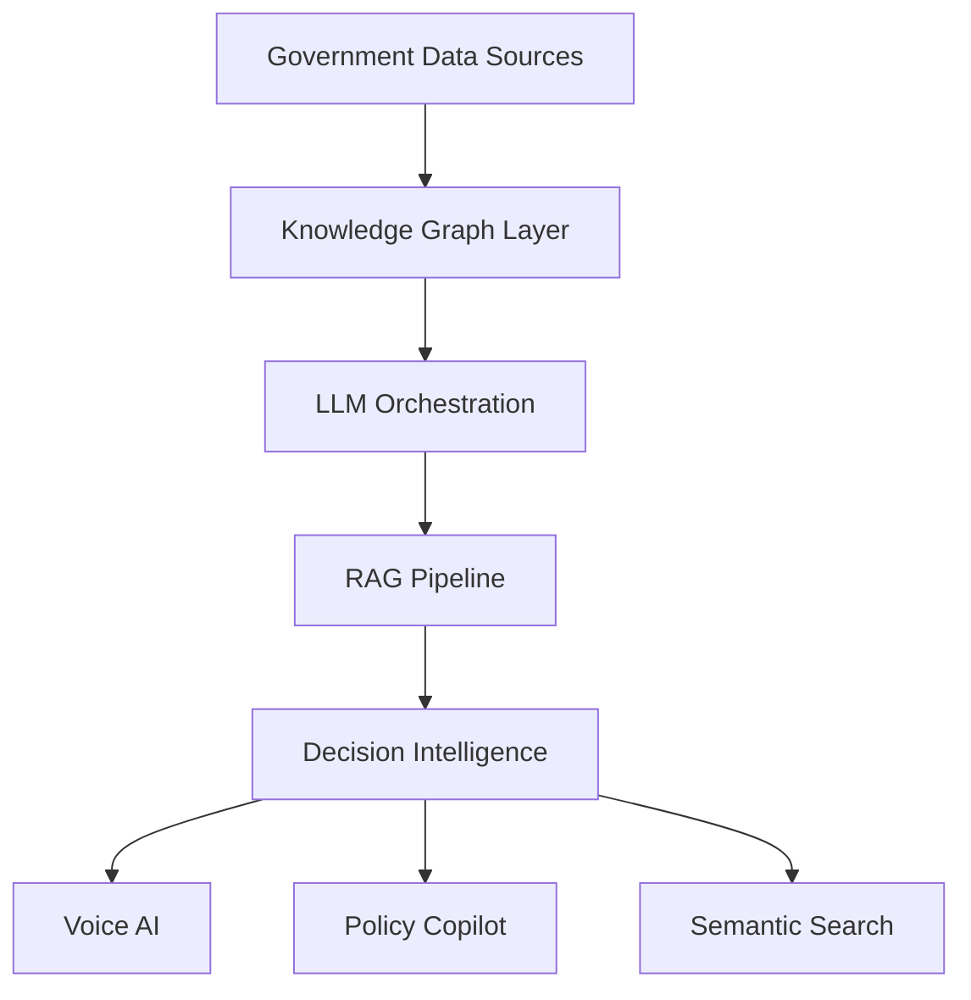

<div align="center">


<br/>


<br/><br/>

<a href="mailto:gangrademanasvi@gmail.com">

</a>
@@ -20,190 +22,455 @@

<br/><br/>


</div>

<br>
---

# About
#  About Me

```yaml
Name: Manasvi Gangrade
Role: AI Researcher & Full-Stack AI Engineer

Education:
  Degree: B.Tech in Artificial Intelligence & Machine Learning
  Institute: Indore Institute of Science & Technology
  Graduation: 2027
  SGPA: 8.79
  CGPA: 7.98

Research Interests:
  - LLM-Augmented Optimization
  - Approximate Nearest Neighbor Search
  - Agentic AI Systems
  - Retrieval-Augmented Generation
  - Cognitive AI & EEG Modeling
  - Governance Intelligence Systems

Academic Highlights:
  - Top 2% AIML Department
  - 20+ National-Level Competitions
  - Highest Podium Record Across IIT & Govt Hackathons

Achievements:
  - Winner: Indore Tech Hackathon 2025 (₹4L)
  - Winner: IIT Bombay I-Hack (₹1L)
  - Winner: InnovateX IIT Bombay (₹50K)
  - Grand Finalist: Smart India Hackathon 2024
```

AI Researcher & Full-Stack AI Engineer focused on:
---

- LLM-Augmented Optimization
- Agentic AI Systems
- Approximate Nearest Neighbor Search
- Retrieval-Augmented Generation
- Governance Intelligence Systems
- Cognitive AI & EEG Modeling
#  Research Domains

Currently building scalable AI systems for governance, semantic retrieval, and decision intelligence.
<div align="center">

<br>
| Domain | Focus |
|---|---|
| LLM Systems | Autonomous reasoning & heuristic generation |
| Optimization | TSP, VRP, JSSP, RL-inspired systems |
| ANN Search | FAISS, HNSW, Product Quantization |
| Cognitive AI | EEG dynamics & confidence decoding |
| Agentic AI | Multi-agent orchestration & RAG |
| Governance AI | Smart-city intelligence systems |

# Tech Stack
</div>

---

#  Technical Stack

<div align="center">


## Languages


<br/><br/>

## AI / ML


<br/>


<br/><br/>

## Backend / Infrastructure


</div>

<br>
---

#  Featured Technical Projects

# Featured Projects
# 🇮🇳 INDRA — Integrated National Decision & Response Architecture

<details open>
<summary><b>🇮🇳 INDRA — Integrated National Decision & Response Architecture</b></summary>
<div align="center">

<br>


Production-scale governance intelligence OS integrating multilingual AI agents, semantic retrieval, RAG pipelines, and cross-domain decision intelligence over 500+ live datasets.
</div>

```txt
Neo4j • LangChain • GPT-4o • FastAPI • React
IndicTrans2 • PostgreSQL • Multi-Agent RAG
```

### Features

- Governance intelligence layer over 500+ live datasets
- RAG-powered administrative co-pilot
- Semantic entity linking across departments
- Multilingual AI assistant across 22 Indian languages
- Voice translation across 230+ languages

<div align="center">

<a href="https://github.com/Manasvi-Gangrade">

</a>

<a href="#">
  
  
</a>

</div>

</details>
### Architecture



---

<details>
<summary><b>🏙️ Urban Intelligence RAG System</b></summary>
# 🏙️ SUVIDHA — Smart Urban Digital Helpdesk

<br>
<div align="center">


Production-grade civic intelligence RAG system enabling natural language access over heterogeneous urban datasets for municipal governance workflows.
</div>

```txt
RAG • Governance AI • FastAPI • Vector Retrieval
React • Node.js • PostgreSQL • Kafka • Redis
AES-256 • TLS 1.3 • OTP Authentication
```

### Features

- Unified citizen-service platform
- Kafka-driven event architecture
- Secure encrypted transaction pipeline
- Redis-backed low-latency sessions
- Multilingual interface support

<div align="center">

<a href="https://github.com/Manasvi-Gangrade">

</a>

<a href="#">
  
</a>

</div>

</details>
---

# 🌊 OceanDepths — Marine Intelligence Platform

<div align="center">


</div>

```txt
Python • AWS S3 • MongoDB • Apache Airflow
OCR • ETL Pipelines • Cloud Data Lakes
```

### Features

- Unified oceanographic + taxonomic data lake
- OCR-powered legacy field digitization
- Automated ETL workflows
- Searchable scientific intelligence system

<div align="center">

<a href="https://github.com/Manasvi-Gangrade">
  
</a>

<a href="#">
  
</a>

</div>

---

<details>
<summary><b>🔍 ANN Search Research</b></summary>
# 🎮 Responsible Gaming Platform

<br>
<div align="center">

Research on quantization-based Approximate Nearest Neighbor systems with theoretical guarantees for latency-sensitive semantic retrieval and RAG systems.


</div>

```txt
FAISS • HNSW • Product Quantization • Sparse JL
MERN • Socket.io • ML/DL • Behavioral Analytics
```

### Features

- Gaming vs Gambling addiction classification
- Real-time monitoring
- Personalized intervention systems
- WebSocket-powered analytics

<div align="center">

<a href="https://github.com/Manasvi-Gangrade">
  
  
</a>

<a href="#">
  
</a>

</div>

</details>
---

# 🚀 NASA Space Biology Knowledge Engine

<div align="center">


</div>

```txt
Knowledge Graphs • Semantic Retrieval • Scientific AI
```

### Features

- Knowledge graph over 608 NASA publications
- Cross-paper semantic discovery
- AI-powered scientific retrieval system

<div align="center">

<a href="https://github.com/Manasvi-Gangrade">
  
</a>

<a href="#">
  
</a>

</div>

---

<details>
<summary><b>🧠 LLM-Augmented Optimization</b></summary>
#  Production Experience

# 🌆 RAG-based Urban Intelligence System

```txt
Production RAG • Governance AI • Urban Intelligence
```

<br>
- Large-scale civic intelligence architecture
- Natural language querying over urban datasets
- Municipal-scale AI deployment

LLM-driven automated heuristic generation framework for combinatorial optimization problems including TSP, VRP, and JSSP.
<div align="center">

<a href="https://github.com/Manasvi-Gangrade">
  
</a>

</div>

---

# 🛰️ Garun — Geospatial Illegal Construction Detection

```txt
LLMs • Optimization • Evolutionary Prompting
Computer Vision • GIS • Drone Surveillance
```

### Features

- Real-time illegal construction detection
- GIS-integrated drone monitoring
- Automated urban surveillance workflows

<div align="center">

<a href="https://github.com/Manasvi-Gangrade">
  
  
</a>

</div>

---

# 📦 Dynamic Mail Transmission System

```txt
RL-inspired Optimization • Multimodal Routing
```

### Features

- National-scale logistics optimization
- Dynamic transport selection
- Reinforcement learning-inspired heuristics

<div align="center">

<a href="https://github.com/Manasvi-Gangrade">
  
</a>

</div>

</details>
---

#  Research Work

# 🧩 Automating Heuristic Design with Large Language Models

<div align="center">


</div>

```txt
TSP • VRP • JSSP • Evolutionary Prompting
```

### Contributions

- LLM-Heuristic framework
- Evolutionary mutation & crossover
- Performance-driven refinement loops
- Convergence guarantees

---

# 🔍 Similarity Search on High-Dimensional Vector Data

<br>
<div align="center">

# Research


</div>

```txt
• LLM-Augmented Optimization
• Approximate Nearest Neighbor Search
• Agentic AI Systems
• Cognitive AI & EEG Modeling
• Semantic Retrieval Systems
• Governance Intelligence Architectures
ANN Search • Product Quantization • FAISS • HNSW
```

<br>
### Contributions

- AKNN systems with theoretical guarantees
- Learned Product Quantization
- Sparse vector retrieval optimization

# Achievements
---

# 🧠 Decoding Career Decision Confidence from EEG Dynamics

<div align="center">


</div>

```txt
EEG • CNN-LSTM • Temporal Attention
```

### Contributions

- Hybrid CNN-LSTM architecture
- Neural oscillation modeling
- Saliency & interpretability systems

---

#  Achievements

<div align="center">

| Achievement | Recognition |
|---|---|
| Indore Tech Hackathon 2025 | ₹4L Prize |
| IIT Bombay I-Hack | ₹1L Prize |
| InnovateX IIT Bombay | ₹50K Prize |
| Smart India Hackathon 2024 | Grand Finalist |
| VISIONX ISRO | 1st Runner-Up |
| Indian Talent National Science Olympiad | State Topper |
| 🥇 Indore Tech Hackathon 2025 | ₹4L Prize |
| 🥇 IIT Bombay I-Hack | ₹1L Prize |
| 🥇 InnovateX IIT Bombay | ₹50K Prize |
| 🚀 Smart India Hackathon 2024 | Grand Finalist |
| 🛰️ VISIONX ISRO | 1st Runner-Up |
| 🧪 Indian Talent National Science Olympiad | State Topper |

</div>

<br>
---

# GitHub Analytics
#  GitHub Analytics

<div align="center">


<br/><br/>


</div>

<br>
---

# Connect
#  Connect With Me

<div align="center">

@@ -221,15 +488,6 @@ LLMs • Optimization • Evolutionary Prompting

</div>

<br>

<div align="center">

```txt
Building intelligent systems that bridge research,
optimization, governance, and scalable AI infrastructure.
```

</div>
<br/>


