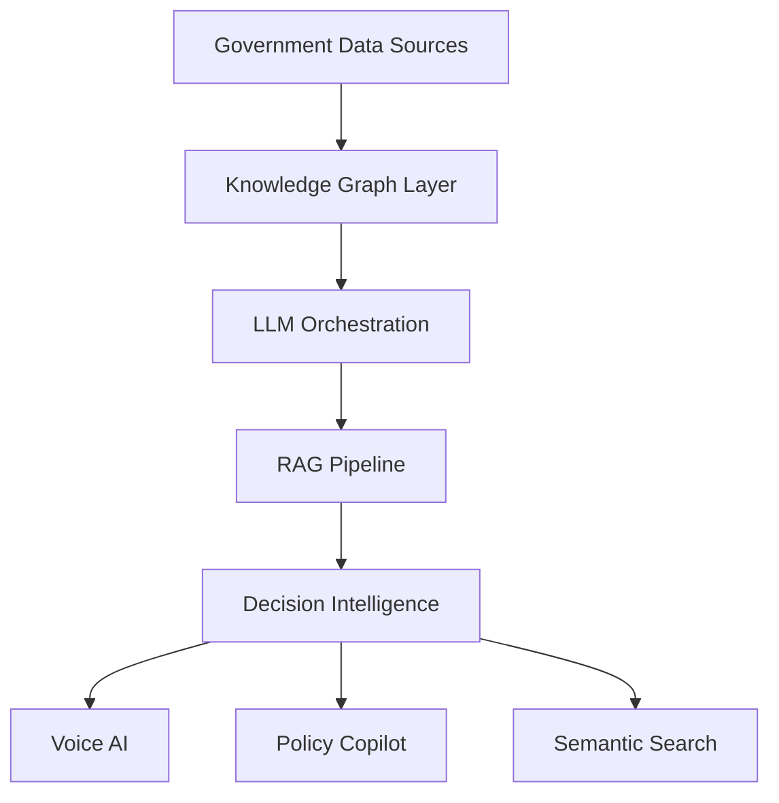

<div align="center">


<br/>


<br/><br/>

<a href="mailto:gangrademanasvi@gmail.com">
  
</a>

<a href="https://linkedin.com/in/YOUR_LINKEDIN">
  
</a>

<a href="https://github.com/YOUR_GITHUB_USERNAME">
  
</a>

<br/><br/>


</div>

---

#  Profile

```yaml
Name: Manasvi Gangrade
Role: AI Researcher & Full-Stack AI Engineer

Education:
  Degree: B.Tech in Artificial Intelligence & Machine Learning
  Institute: Indore Institute of Science & Technology
  Graduation: 2027
  SGPA: 8.79
  CGPA: 7.98

Research Interests:
  - LLM-Augmented Optimization
  - Approximate Nearest Neighbor Search
  - Agentic AI Systems
  - Retrieval-Augmented Generation
  - Cognitive AI & EEG Modeling
  - High-Dimensional Vector Retrieval
  - Governance Intelligence Systems

Achievements:
  - Winner: Indore Tech Hackathon 2025 (₹4L)
  - Winner: IIT Bombay I-Hack (₹1L)
  - Grand Finalist: Smart India Hackathon 2024
```

---

#  Technical Stack

<div align="center">

## Languages


<br/><br/>

## AI / Machine Learning


<br/>


<br/><br/>

## Backend / Infrastructure


</div>

---

#  Technical Projects

#  INDRA — Integrated National Decision & Response Architecture

<div align="center">


</div>

```txt
Neo4j • LangChain • GPT-4o • FastAPI • React
IndicTrans2 • PostgreSQL • Multi-Agent RAG
```

### Features

- Governance intelligence layer over 500+ live datasets
- RAG-powered administrative co-pilot
- Semantic entity linking across departments
- Multilingual AI assistant across 22 Indian languages
- Voice translation across 230+ languages

<div align="center">

<a href="https://github.com/YOUR_GITHUB_USERNAME/indra">
  
</a>

<a href="https://your-demo-link.com">
  
</a>

</div>

### Architecture



---

#  SUVIDHA — Smart Urban Digital Helpdesk

<div align="center">


</div>

```txt
React • Node.js • PostgreSQL • Kafka • Redis
AES-256 • TLS 1.3 • OTP Authentication
```

### Features

- Unified citizen-service platform
- Kafka-driven event architecture
- Secure encrypted transaction pipeline
- Redis-backed low-latency sessions

<div align="center">

<a href="https://github.com/YOUR_GITHUB_USERNAME/suvidha">
  
</a>

<a href="https://your-demo-link.com">
  
</a>

</div>

---

#  OceanDepths — Marine Intelligence Platform

<div align="center">


</div>

```txt
Python • AWS S3 • MongoDB • Apache Airflow
OCR • ETL Pipelines • Cloud Data Lakes
```

### Features

- Unified oceanographic data lake
- OCR-powered legacy digitization
- Automated ETL workflows
- Searchable scientific intelligence platform

<div align="center">

<a href="https://github.com/YOUR_GITHUB_USERNAME/oceandepths">
  
</a>

<a href="https://your-demo-link.com">
  
</a>

</div>

---

#  Responsible Gaming Platform

<div align="center">


</div>

```txt
MERN • Socket.io • ML/DL • Behavioral Analytics
```

### Features

- Gaming vs Gambling addiction classification
- Real-time monitoring
- Behavioral intervention engine
- WebSocket-powered analytics

<div align="center">

<a href="https://github.com/YOUR_GITHUB_USERNAME/responsible-gaming">
  
</a>

<a href="https://your-demo-link.com">
  
</a>

</div>

---

#  NASA Space Biology Knowledge Engine

<div align="center">


</div>

```txt
Knowledge Graphs • Semantic Retrieval • Scientific AI
```

### Features

- Knowledge graph over 608 NASA publications
- Cross-paper semantic discovery
- AI-powered scientific retrieval system

<div align="center">

<a href="https://github.com/YOUR_GITHUB_USERNAME/nasa-space-biology">
  
</a>

<a href="https://your-demo-link.com">
  
</a>

</div>

---

#  Production Experience

# RAG-based Urban Intelligence System

<div align="center">


</div>

```txt
Production RAG • Governance AI • Urban Intelligence
```

- Large-scale civic intelligence architecture
- Natural language querying over urban datasets
- Municipal-scale AI deployment

<div align="center">

<a href="https://github.com/YOUR_GITHUB_USERNAME/urban-rag">
  
</a>

</div>

---

# Garun — Geospatial Illegal Construction Detection

<div align="center">


</div>

```txt
Computer Vision • GIS • Drone Surveillance
```

### Features

- Real-time illegal construction detection
- GIS-integrated drone monitoring
- Automated urban surveillance workflows

<div align="center">

<a href="https://github.com/YOUR_GITHUB_USERNAME/garun">
  
</a>

</div>

---

# Dynamic Mail Transmission System

<div align="center">


</div>

```txt
RL-inspired Optimization • Multimodal Routing
```

### Features

- National-scale logistics optimization
- Dynamic transport selection
- Reinforcement learning-inspired heuristics

<div align="center">

<a href="https://github.com/YOUR_GITHUB_USERNAME/dynamic-mail-routing">
  
</a>

</div>

---

#  Research Work

# Automating Heuristic Design with Large Language Models

<div align="center">


</div>

```txt
TSP • VRP • JSSP • Evolutionary Prompting
```

### Contributions

- LLM-Heuristic framework
- Evolutionary mutation & crossover
- Performance-driven refinement loops
- Convergence guarantees

<div align="center">

<a href="https://github.com/YOUR_GITHUB_USERNAME/llm-heuristics">
  
</a>

</div>

---

# Similarity Search on High-Dimensional Vector Data

<div align="center">


</div>

```txt
ANN Search • Product Quantization • FAISS • HNSW
```

### Contributions

- AKNN systems with theoretical guarantees
- Learned Product Quantization
- Sparse vector retrieval optimization

<div align="center">

<a href="https://github.com/YOUR_GITHUB_USERNAME/ann-research">
  
</a>

</div>

---

# Decoding Career Decision Confidence from EEG Dynamics

<div align="center">


</div>

```txt
EEG • CNN-LSTM • Temporal Attention
```

### Contributions

- Hybrid CNN-LSTM architecture
- Neural oscillation modeling
- Saliency & interpretability systems

<div align="center">

<a href="https://github.com/YOUR_GITHUB_USERNAME/eeg-confidence">
  
</a>

</div>

---

#  Achievements

<div align="center">

| Achievement | Recognition |
|---|---|
| Indore Tech Hackathon 2025 | ₹4L Prize |
| IIT Bombay I-Hack | ₹1L Prize |
| InnovateX IIT Bombay | ₹50K Prize |
| Smart India Hackathon 2024 | Grand Finalist |
| VISIONX ISRO | 1st Runner-Up |
| Indian Talent National Science Olympiad | State Topper |

</div>

---

#  GitHub Analytics

<div align="center">


<br/><br/>


</div>

---

#  Connect

<div align="center">

<a href="mailto:gangrademanasvi@gmail.com">
  
</a>

<a href="https://linkedin.com/in/YOUR_LINKEDIN">
  
</a>

<a href="https://github.com/YOUR_GITHUB_USERNAME">
  
</a>

</div>

<br/>


